# eHMI — 「車の合図（eHMI）→ 歩行者の反応」確率シミュレータ（Normalizing Flow）

自動運転車の外部表示 **eHMI**（＋接近する車そのもの）という *キュー* に対して、
**歩行者が実際どう動くか**を確率的に生成するシミュレータを Normalizing Flow で学習する
プロジェクト。motionsim（音声刺激→頭部運動）の**姉妹プロジェクト**で、目的は
「別ドメイン・**20人**の cue→response データで、予測機構・較正・LOUO/few-shot を検証する」こと。

> **なぜこのデータか** — motionsim の律速は「参加者7人・個人差支配」。ここは同じ
> 「キュー→ユーザ反応」構造を**20人**で持つため、個人差・few-shot 個人化・較正を
> motionsim では不可能な規模で外部検証できる。ドメイン（車/横断 vs 盲人頭部ナビ）は
> 遠いので、**機構の方法論的検証**として使う（forward model の直接転移ではない）。

## データ

Bazilinskyy, Kooijman, … De Winter (2022) *"Get out of the way! Examining eHMIs in
critical driver-pedestrian encounters in a coupled simulator"*。
**4TU.ResearchData, DOI [10.4121/20224281](https://doi.org/10.4121/20224281)（CC BY 4.0）**。

| 項目 | 内容 |
|---|---|
| 取得 | 連結VRシミュレータ。**ドライバー役とペア**で、手動運転の車が歩行者に接近する「危機的遭遇」。歩行者は**モーションスーツ（全身スケルトン）**着用 |
| 規模 | **20組（＝歩行者20人）× 各20試行**（Scenario1: 1台, Scenario2: 2台）、~50–100Hz を 10Hz に整列 → 395試行 / 約122,000ステップ |
| キュー | ①**接近する車のkinematics**（range/bearing/approach/TTC＝時間変化するキュー）②**eHMI条件**（None/Left/Right＝方向指示。interim questionnaire 由来、None289/Left68/Right43） |
| 反応 | 歩行者 avatar の平面運動（横断・前進/後退・左右回避）。追加で全身関節も取得可 |
| 付随 | 安全感(1–7)・「eHMIを見たか/従ったか」の自己申告（trial単位） |

`data/data/` に元CSV（`fetch` で 4TU から取得・展開）。`data.zip`(229MB) のみ使用し、
`unity.zip`(5.6GB) は取得しない。

## パイプライン（motionsim と同じ思想・冪等）

```
 4TU data.zip        extract            features            train              report / replay
 Session*/*.csv ──▶ data/raw/*.parquet ─▶ data/processed/* ─▶ results/metrics.json ─▶ 図・RESULTS.md / mp4
 3段ヘッダ+全身ログ   10Hz整列+eHMI紐付   自己中心増分+キュー   LOUO(Flow/MDN/基線)     確率曲線・較正・予測扇
```

| モジュール | 役割 |
|---|---|
| `config.py` | パス・**列マップ**（S1=190列/S2=209列の3段ヘッダから確定）・サンプリング・スキーマ |
| `extract.py` | Unityログを解析→10Hzのper-trial parquet。questionnaire から**eHMI条件・安全感・遵守**を各trialに紐付け（`trial_meta.parquet`） |
| `features.py` | **試行固定の「横断フレーム」**（PCA主軸＝前進/直交＝横、車と反対側を+lat）で 2D増分 `(Δfwd, Δlat)` に整形＋キュー特徴 |
| `model.py` | 条件エンコーダ（GRU履歴＋eHMI/scenario/user埋め込み＋車kinematics MLP）＋ **NSF Flow** ／ MDN ／ 非学習基線 |
| `train.py` | **20-fold LOUO**。held-out NLL・rollout ADE/FDE・較正。`--loocv`で全fold、既定は1人smoke、`--fast`で高速 |
| `report.py` | 図（NLL棒・較正曲線・反応曲線・per-user）＋ `reports/RESULTS.md` を再生成 |
| `replay.py` | 実試行を上から再生＋**Flow予測扇**＋eHMI色の車。mp4化 |

### 予測の定式化
- 予測対象 `x = (Δfwd, Δlat)`（0.1秒ごと、試行固定の横断フレーム。geometryを吸収し、
  Δfwd=前進/後退・Δlat=左右回避＝eHMIが効かせたい成分に一致）。
- 条件 `c = Encoder(運動履歴, eHMI, 車の range/bearing/approach/TTC, scenario, 参加者)`。
- `p(x│c)` を条件付き NSF で学習。自己回帰で「軌跡の雲」を生成。

## できる/検討できるモデル（このデータの“メニュー”）

1. **eHMI/車キュー → 歩行者応答の確率予測**（本実装）。基線比較で「学習可能か」を判定。
2. **20人 LOUO と few-shot 個人化** — 個人差の母数が20人。「未知の人をどれだけ当てられるか」
   「数試行で較正できるか」を motionsim(7人)では不可能な規模で検証（＝律速の外部検証）。
3. **較正（calibration）を第一級に** — 予測帯が“正直”か。conformal 後付けも容易。
4. **READ/surprise モード** — 観測動作の cue条件付き尤度＝「eHMIが伝わったか」の計器。
   自己申告「eHMIを見た/従った」が**教師ラベル**として存在（検証可能！）。
5. **反応の分布・エントロピー＝キューの明瞭度**スコア（None/Left/Right でどれだけ応答が割れるか）。
6. **全身スケルトン**への拡張（後退・すくみ等の姿勢反応。列は取得済み）。

## セットアップ・実行（uv / Python 3.12）

```bash
uv sync
uv run python -m ehmi.fetch          # 4TU から data.zip を取得・展開（既存はスキップ）
uv run python -m ehmi.extract        # db3相当のログ -> data/raw/*.parquet + trial_meta
uv run python -m ehmi.features       # -> data/processed/{features.parquet, norm_stats.json, vocab.json}
uv run python -m ehmi.train          # smoke（1人 hold-out）。--loocv で全20fold、--fast で高速
uv run python -m ehmi.replay         # 予測扇つき mp4（eHMI発火trialを自動選択）
# --- 追加実験（few-shot / クラスタ / causal）---
uv run python -m ehmi.pretrain       # 全20人モデル（クラスタ/causalの土台）
uv run python -m ehmi.fewshot        # WP1 few-shot 学習曲線（(a)埋め込み+(d)メタ）
uv run python -m ehmi.cluster        # WP2 クラスタ分類＋個人識別
uv run python -m ehmi.causal         # WP3 層別CATE＋個人反事実(ON/OFF)
uv run python -m ehmi.anomaly        # WP5 危険予測/異常検知（surprise・near-miss予兆・個人化）
uv run python -m ehmi.report         # 全結果を README.md に一望注入＋図
```

結果は下の「結果」節（`report` が自動生成）に一望できます。追加の実験は
`uv run python -m ehmi.pretrain / fewshot / cluster / causal` → `report` で更新。

<!--RESULTS:START-->

# 結果（自動生成 — `uv run python -m ehmi.report`）

各図の下に「見方」を付けています。

## 1. cue→反応は学習可能（20-fold LOUO）

予測対象は 0.1 秒ごとの歩行者の自己中心増分 (Δfwd, Δlat)。基線と held-out NLL で比較。

| model | held-out NLL ↓ | rollout ADE (m) ↓ |
|---|---|---|
| Gaussian基線 | +2.70 ± 0.34 | — |
| 等速度基線 | +1.74 ± 0.52 | 0.49 |
| MDN | -1.17 ± 0.63 | — |
| **Flow** | **-1.25 ± 0.63** | **0.47** |

> **NLL（負の対数尤度）**: モデルが実際の動きをどれだけ当てたかの指標。**低いほど良い**（負でOK）。3 nats 差 ≈ 約20倍の当てやすさ。

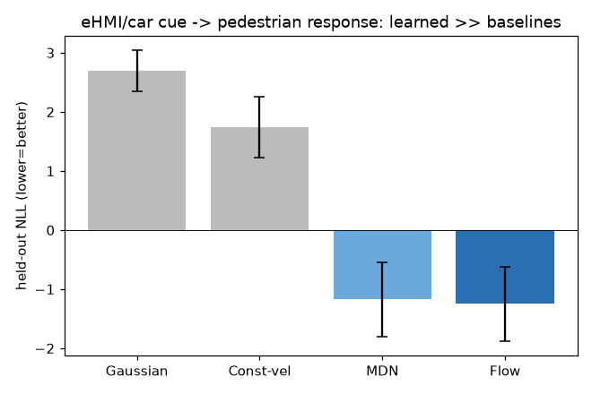

> **見方**: 棒＝各手法の held-out NLL（低いほど良い）。灰＝学習しない基線、青＝学習モデル。Flow/MDN が基線を大きく下回る＝「cue→反応」を確かに学習できている定量証拠。

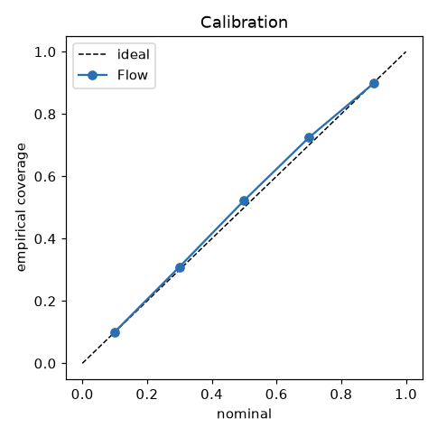

> **見方**: 横=モデルが宣言した確率区間、縦=実際にその区間へ入った割合。対角線=理想（正直）。線が対角なら「50%と言えば本当に約50%入る」。ここでは対角より少し上＝区間がやや広め（過小自信）。

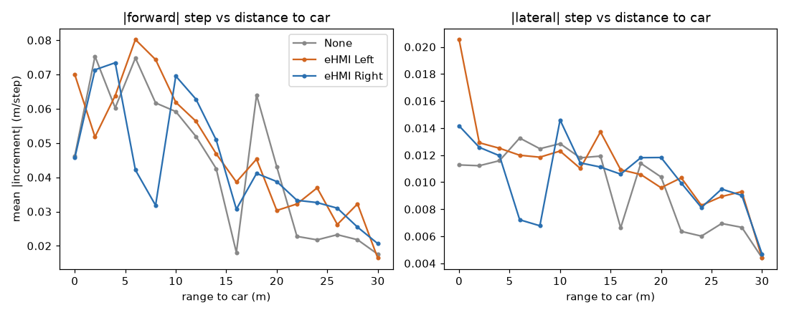

> **見方**: 横=車までの距離(m)、縦=1ステップの平均移動量。左(前進)・右(横)。色=eHMI条件。車が近づく（左へ行く）ほど動きが変わる＝データに車キューへの反応が見える。

per-user の Flow NLL は **-2.40〜-0.11** と広い＝**個人差が支配的**（誰を隠すかで成績が決まる）。
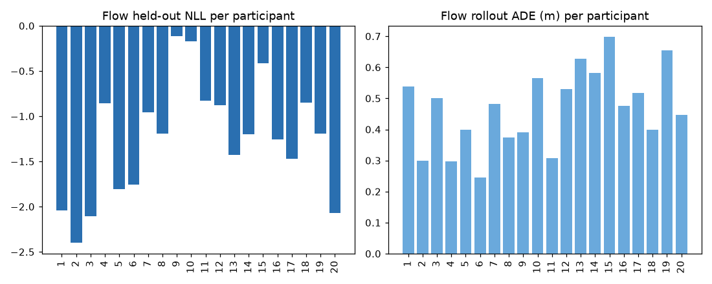

> **見方**: 棒1本＝「その人を隠して学習・評価」した1人分の成績。左=NLL、右=軌跡誤差ADE。棒の高さのばらつきの広さ＝個人差の大きさ。律速はモデルでなく“人の違い”。


## 2. few-shot 個人化（新しい人を数試行で較正）

**仕組み**: 学習済みモデルの重みは全て凍結し、**新しい人の 8 次元「個人ベクトル」だけ**をその人の k 試行で最適化（＝性格空間のどこに座るかを探す）。k=0 は未知(unknown)ベクトル。

(a) 埋め込みだけ適応（全20人 LOUO）：zero-shot(k=0) NLL **-1.25** → k=8本で **-1.57**（oracle＝その人を学習に含めた上限 -1.97）。**1〜2試行で大半が個人化**。

| k (適応試行) | 0 | 1 | 2 | 3 | 5 | 8 |
|---|---|---|---|---|---|---|
| (a) embedding NLL | -1.25 | -1.48 | -1.52 | -1.53 | -1.55 | -1.57 |
| (d) Reptile meta NLL | -1.17 | -0.15 | -0.21 | -0.16 | -0.72 | -0.80 |

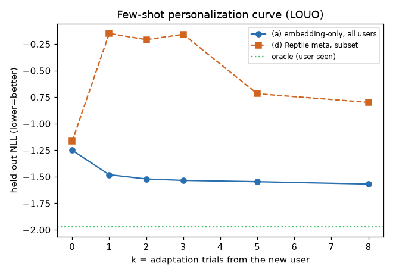

> **見方**: 横=新しい人の適応試行数 k、縦=held-out NLL（低いほど良い）。青(a)=埋め込みだけ適応は k=1〜2 で急改善し oracle(緑点線=上限)に接近＝少数で個人化できる。橙(d)=メタ学習+全微調整は k=1 で悪化＝1〜数試行での全体微調整は過学習（20人では埋め込み適応が正解）。


## 3. 行動フィンガープリント：クラスタ分類＋個人識別

各人の8次元「個人ベクトル」を行動の指紋とみなし、(i)少数タイプにクラスタ、(ii)尤度で人/型を当てる。

埋め込みを **K=3 タイプ**にクラスタ（silhouette 0.15＝弱め＝ソフトな型）。
**個人識別 top-1 = 75%**（偶然5%）＝反応で人を見分けられる。 **タイプ分類 = 80%**。

| type | n | 横断速度 | 横回避 | eHMI遵守 | 安全感 |
|---|---|---|---|---|---|
| 0 | 7 | 0.107 | 0.0058 | 0.17 | 4.74 |
| 1 | 8 | 0.123 | 0.0059 | 0.15 | 4.83 |
| 2 | 5 | 0.151 | 0.0054 | 0.13 | 4.61 |

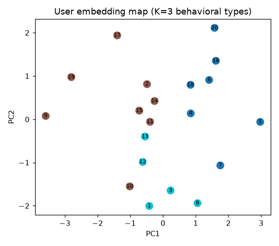

> **見方**: 各点＝1人の個人ベクトルをPCAで2Dに落としたもの。数字＝参加者ID、色＝クラスタ。近い人ほど反応の仕方が似ている。

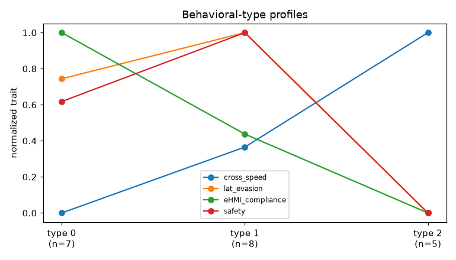

> **見方**: 各タイプの行動特徴（0–1に正規化）。線の高低の違いがタイプの性格。ここでは主に横断速度で分かれる（type0=遅い〜type2=速い）。

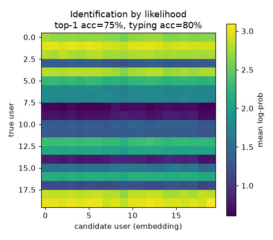

> **見方**: 行=本当のユーザ、列=候補の個人ベクトル、明るい=そのベクトルでの尤度が高い。**明るい対角線**＝自分のベクトルが自分の試行を最もよく説明＝指紋が成立している。


## 4. causal / 反事実（eHMI ON/OFF）

eHMI は実験で割り付けた変数なので `do(eHMI)` を扱える。**反事実**＝可逆な Flow で「観測した反応→潜在 z を逆算→eHMI を OFF に差し替えて z 固定で再生成」＝**同じ人・同じ気質のまま、もし警告が無かったら**の動きを生成。

ON 110 / OFF 285 試行。反事実効果はタイプで異なる（効果の異質性）：

| type | Δ peak-lateral: ON − do(OFF) (m) | n |
|---|---|---|
| 0 | -0.134 m | 35 |
| 1 | -0.097 m | 48 |
| 2 | -0.070 m | 27 |

**解釈**: 値＝(実際ONの横回避のピーク) −(反事実OFFの横回避のピーク)。**負＝eHMIがあると横回避が小さい**（車の進路が分かり、無駄に大きく避けなくて済む）。type0(遅い横断)で最も大きく、type2(速い)で小さい＝eHMIは慎重な人ほど効く。

> 注: eHMI ON/OFF only (L/R entangled w/ car maneuver); counterfactual is model-dependent (SCM assumption), not point-validatable.

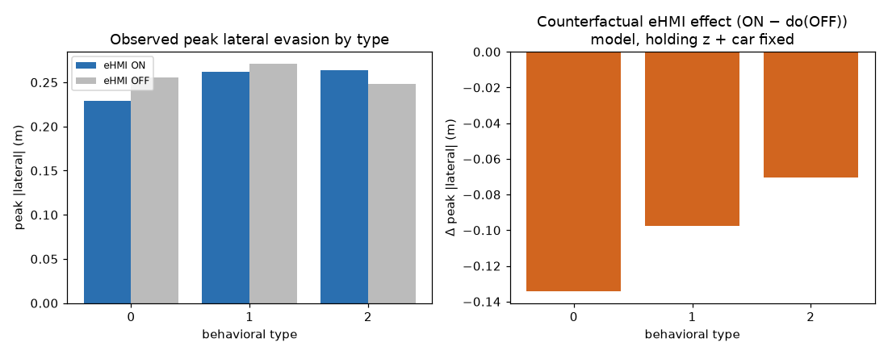

> **見方**: 左=観測データの ON(青) vs OFF(灰) の横回避ピーク（タイプ別）。右=モデル反事実の効果 ON−do(OFF)。棒が負＝eHMIで横回避が減る。棒の高さがタイプで違う＝効果の異質性。

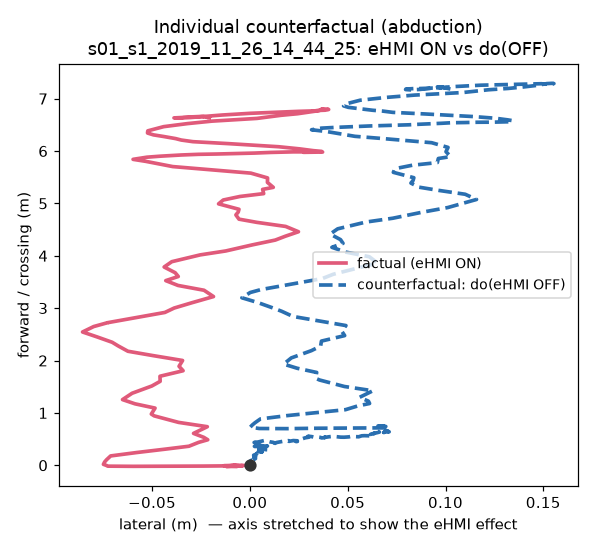

> **見方**: ある1人・1試行の上から見た経路。ピンク実線=実際(eHMI ON)、青破線=反事実(同じ人がeHMI無しなら)。青が右に多く彷徨う＝警告が無ければもっと横に避けていた。横軸(lateral)は効果を見せるため引き伸ばし。


## 5. 異常検知 / 危険予測（Flow の surprise）

**surprise = −log p(動き│状況)** ＝「その状況で、その動きがどれだけ意外か」。条件付きなので**車が近いこと自体は意外でなく**（条件に入っている）、**状況に対して動きが異常なときだけ大きく**なる＝“危険な行動”の指標。
（危険ラベルはデータ由来：最接近 < 2.0m を near-miss=22本／> 5.0m を safe=346本）

**結果（正直に・混在）**：
- **A. 群の新規性**（片タイプで学習→他タイプを異常検知）：AUC **0.51** → 検知できず（クラスタが弱く≒同質）。
- **B. near-miss の予測**：near-miss試行の surprise は**最接近の約 3.0秒前**（車がまだ遠い時）から高い＝**物理的接近より早い予兆**。試行単位 AUC surprise **0.55** > jerk基線 0.43（ただし near-miss 22本と少なく弱め）。
- **D. 個人化で誤警報減**：safe試行の surprise 平均が population **-1.68** → few-shot個人化で **-1.87**（低い＝“その人の正常”に合わせ誤検知が減る）。

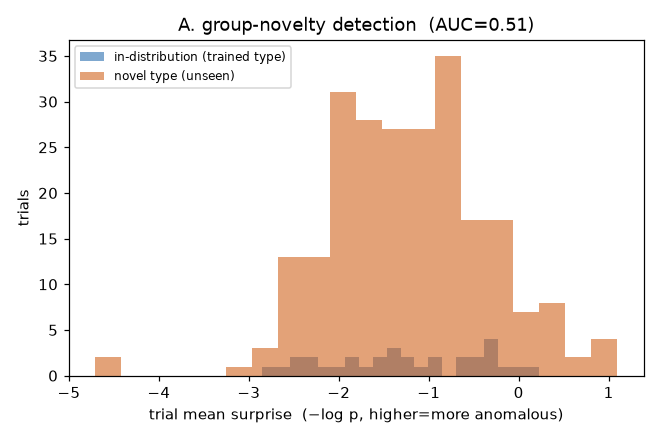

> **見方**: 学習した型の試行(青)と未学習の型の試行(橙)の surprise の分布。重なりが大きい＝群の新規性は surprise で分離しづらい（クラスタが横断速度差程度で弱いため）。

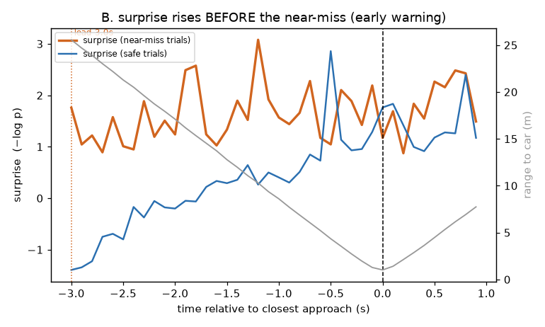

> **見方**: 横=最接近(t=0)からの相対時刻、縦左=surprise、縦右(灰)=車までの距離。橙(near-miss)は t=0 の数秒前・車がまだ遠い時点から surprise が高い＝距離ベースの警報より早く“危険な動き”を捉えられる可能性。青(safe)は低いまま。

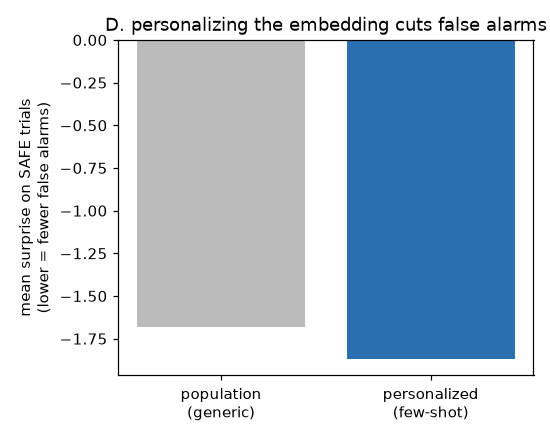

> **見方**: 安全な試行での平均 surprise。左=集団基準、右=few-shotで本人に個人化。個人化すると下がる＝「その人の癖だが安全」を異常と誤らない＝アラーム疲労の低減。


> **正直な限界**: near-miss が全体の約6%(≈20本)と少なく、群も弱いソフトクラスタのため、A は分離せず・B の AUC も弱い。強い主張は避け、**(i) surprise が物理接近より早い予兆になりうること、(ii) 個人化が誤警報を下げること**の2点に留める。本格化には near-miss を増やすデータ収集が必要。

## 6. replay（実試行＋Flow予測扇）

> **見方**: 上から見た1試行の時間再生。**ピンク=歩行者の実際の軌跡**、**青い扇=Flowが予測する次~1.5秒の分布**（広い=不確実）、**四角+矢印=車**（色=eHMI, 遠いので端に表示、range=距離）。青い扇の中にピンクが入り続けるほど予測が当たっている。

### replay_s01_s1_2019_11_26_14_44_25.gif

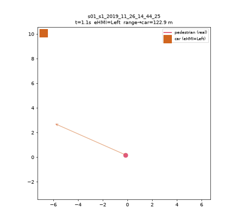

### replay_s01_s2_2019_11_26_14_40_14.gif

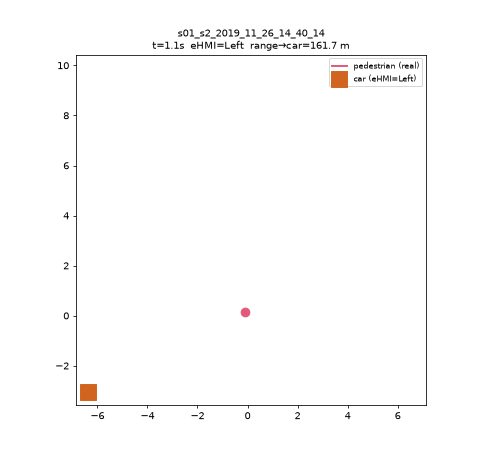

### replay_s19_s2_2019_12_04_15_56_20.gif

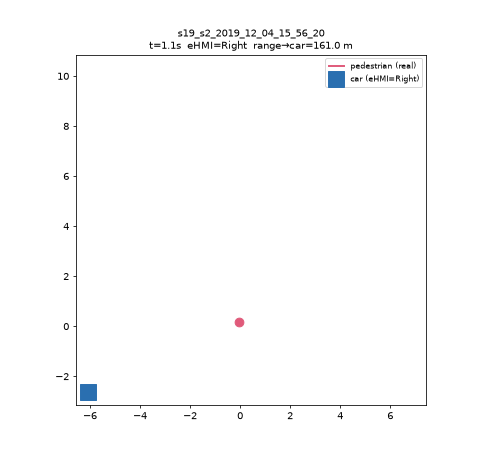

### replay_s19_s2_2019_12_04_15_57_40.gif

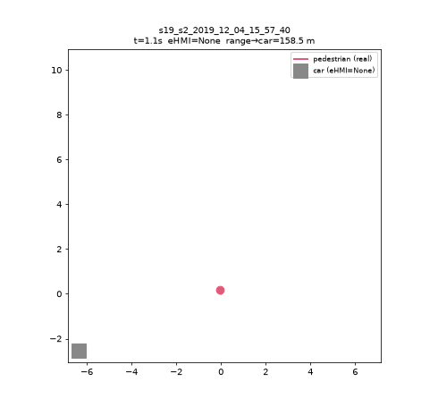

### replay_s19_s2_2019_12_04_16_07_53.gif


### replay_s20_s2_2019_12_04_17_21_38.gif

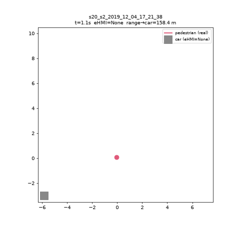

高画質版（mp4。GitHub上ではリンク、ローカルビューアでは下のプレーヤーが再生）:

<video controls width="480" src="reports/figures/replay_s01_s1_2019_11_26_14_44_25.mp4"></video>
[replay_s01_s1_2019_11_26_14_44_25.mp4](reports/figures/replay_s01_s1_2019_11_26_14_44_25.mp4)

<video controls width="480" src="reports/figures/replay_s01_s2_2019_11_26_14_40_14.mp4"></video>
[replay_s01_s2_2019_11_26_14_40_14.mp4](reports/figures/replay_s01_s2_2019_11_26_14_40_14.mp4)

<video controls width="480" src="reports/figures/replay_s19_s2_2019_12_04_15_56_20.mp4"></video>
[replay_s19_s2_2019_12_04_15_56_20.mp4](reports/figures/replay_s19_s2_2019_12_04_15_56_20.mp4)

<video controls width="480" src="reports/figures/replay_s19_s2_2019_12_04_15_57_40.mp4"></video>
[replay_s19_s2_2019_12_04_15_57_40.mp4](reports/figures/replay_s19_s2_2019_12_04_15_57_40.mp4)

<video controls width="480" src="reports/figures/replay_s19_s2_2019_12_04_16_07_53.mp4"></video>
[replay_s19_s2_2019_12_04_16_07_53.mp4](reports/figures/replay_s19_s2_2019_12_04_16_07_53.mp4)

<video controls width="480" src="reports/figures/replay_s20_s2_2019_12_04_17_21_38.mp4"></video>
[replay_s20_s2_2019_12_04_17_21_38.mp4](reports/figures/replay_s20_s2_2019_12_04_17_21_38.mp4)


<!--RESULTS:END-->

## 注意・今後
- **ドメイン差**：車/横断であり盲人頭部ナビではない。用途は**機構検証**（few-shot・較正・READ）。
- eHMI方向(Left/Right)の絶対意味は横断フレームで一部平準化されるが、車 bearing が補助。
- 進行方向はモーションスーツの yaw が定数のため**速度方向＋PCA**で定義（body facing は未使用）。
- rollout はまだ短ホライズン中心（motionsim 同様、長軌跡は要 scheduled-sampling）。
